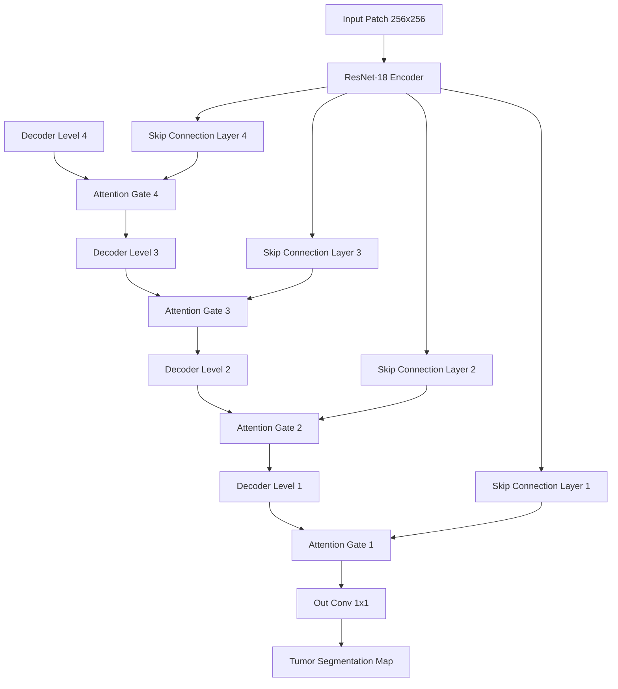

# 🔬 Histopathology Tumor Detection & Segmentation (NumPy + PyTorch)

An end-to-end, high-performance deep learning pipeline designed to detect and segment tumor regions in gigapixel-scale whole slide images (WSIs). This repository features custom, from-scratch **NumPy implementations** for crucial preprocessing and simulation tasks—such as Macenko stain normalization, Otsu's thresholding-based tissue masking, and synthetic whole-slide image simulation—coupled with state-of-the-art **PyTorch semantic segmentation networks** (ResNet-UNet and Attention-UNet).

---

## 🚀 Key Features

*   **Custom NumPy Preprocessing**:
    *   **Macenko Stain Normalization**: Color standardization computed using singular value decomposition (SVD) on optical densities (OD) to align slide color spaces.
    *   **Otsu's Thresholding & Tissue Masking**: Automated foreground tissue masking via variance maximization on the grayscale intensity channel.
    *   **WSI Synthetic Slide Simulator**: Generating synthetic $1024 \times 1024$ whole-slide images with mock stroma textures, normal/tumor cell nuclei, and tumor clusters for environment dry-runs.
*   **Dual Segmentation Architectures**:
    *   **ResNet-UNet**: A robust encoder-decoder network using a pre-trained ResNet-18 feature extractor.
    *   **Attention-UNet**: A custom network integrating **Attention Gates** in the decoder's skip connections to dynamically filter out non-tissue backgrounds and focus on critical tumor boundaries.
*   **Whole-Slide Inference & Stitching**: High-performance grid search utilizing sliding windows to produce tumor probability heatmaps.
*   **Comprehensive Diagnostics**: Automatic calculation of metrics (IoU, Dice, Precision, Recall, Accuracy), Free-Response ROC (FROC) curve plotting, and stain normalization ablation studies.

---

## 📂 Project Structure

```
histopathology_segmentation/
│
├── config.py              # Path configurations, patch sizes, and training hyperparameters
├── data_pipeline.py       # Tissue masking, patch extraction, and custom PyTorch datasets
├── models.py              # ResNet18 Classifier, Standard U-Net, and Attention U-Net
├── train.py               # Mixed-precision training and validation execution loops
├── evaluate.py            # FROC plotting, ablation studies, and slide-level stitching
├── main.py                # Command-line interface orchestration script
├── requirements.txt       # Project python dependencies
├── unet_model.py          # Standalone notebook model architecture implementations
├── utils_segmentation.py  # Standalone NumPy helper functions & slide simulator
├── histopathology_tumour_detection.ipynb  # Interactive Jupter notebook pipeline
└── README.md              # Project documentation (this file)
```

---

## 📊 Dataset & Preprocessing

This pipeline supports training on both real clinical slides and simulated tissue datasets:
1.  **Kaggle Kumar Dataset**: A dataset containing triple-negative breast cancer (TNBC) tissue samples. It consists of high-resolution `.tif` tissue images matched with `.png` binary tumor overlay masks.
2.  **Synthetic WSI Dataset**: Designed using **NumPy** to bypass resource constraints. The simulator generates tissue textures, structures stroma color profiles, and scatters nuclei representing:
    *   **Normal cells**: Smaller, lighter, scattered nuclei.
    *   **Tumor cells**: Larger, darker, densely clustered nuclei.

### Preprocessing Pipeline:
*   **Otsu Foreground Extraction**: Separates background cover glass from target biopsy tissue by converting RGB slides to grayscale and determining the optimal bimodal threshold that maximizes between-class variance.
*   **Macenko Stain Normalization**: Standardizes histopathology staining variation. The algorithm converts input RGB channels to Optical Density (OD) space, uses SVD to find the principal stain vectors for hematoxylin and eosin (H&E), projects the intensities, normalizes concentration levels, and converts the image back to RGB.

---

## 📐 Model Architectures & Core Math

### 1. ResNet-UNet
Combines a pre-trained **ResNet-18** encoder with a custom decoder. The decoder upsamples features using transposed convolutions (`ConvTranspose2d`) and merges them with encoder maps via standard skip connections to recover high-resolution boundaries.

### 2. Attention-UNet
Integrates learnable **Attention Gates (AGs)** in the skip paths. Coarser feature maps from the decoder ($g$) act as gating signals to filter high-resolution skip features ($x$) from the encoder. This suppresses redundant activations in background structures.



### 3. Loss Function: Hybrid DiceBCE
The models are trained using a hybrid loss function combining **Binary Cross-Entropy (BCE) Loss** (for pixel-wise classification) and **Dice Loss** (to handle class imbalance):

$$\mathcal{L}_{\text{hybrid}} = \mathcal{L}_{\text{BCE}} + (1 - \text{Dice Coefficient})$$

$$\text{Dice} = \frac{2 \cdot |Y \cap \hat{Y}|}{|Y| + |\hat{Y}|}$$

---

## 📓 Notebook Code Cell Functionality

The interactive notebook [histopathology_tumour_detection.ipynb](file:///Users/deepanshsaggar/.gemini/antigravity-ide/scratch/histopathology_segmentation/histopathology_tumour_detection.ipynb) is organized into 13 distinct code cells that implement the complete pipeline. Below is the functionality of each cell:

| Cell # | Type | Primary Function / Script Written | Inputs | Outputs | Description & Logic |
| :--- | :--- | :--- | :--- | :--- | :--- |
| **Cell 1** | Code | Writes `utils_segmentation.py` | Configuration constants | `utils_segmentation.py` | Contains helper functions written from scratch in NumPy: `otsu_threshold` and `otsu_tissue_mask` for tissue identification, `normalize_stain_macenko` for stain color alignment, `WSI_Simulator` for generating synthetic slides, and the `TissuePatchDataset` loader class. |
| **Cell 2** | Code | Writes `unet_model.py` | Module configurations | `unet_model.py` | Contains the network layers: `DoubleConv` (standard convolutional blocks), `AttentionBlock` (gating mechanism for soft attention), `ResNetUNet` and `AttentionUNet` networks, and the hybrid loss function `DiceBCELoss`. |
| **Cell 3** | Code | System Setup | Operating system variables | Printed hardware diagnostic status | Checks system details, verifies PyTorch installation, identifies GPU availability (CUDA), and prints the GPU hardware model name (e.g., NVIDIA T4) to optimize model speed. |
| **Cell 4** | Code | Kumar Dataset Integration | Kaggle input directory paths | Loaded arrays `real_images` & `real_masks`, PyTorch `train_loader` | Scans the Kaggle environment paths for the Kumar breast cancer dataset. Matches `.tif` slides with `.png` masks, pairs them, loads them into memory, and constructs a training patch loader if the dataset is found. |
| **Cell 5** | Code | Synthetic Dataset Simulation | Random seeds (`101`, `102`, `103`, `201`) | `sim_train_loader`, `sim_val_loader` | Leverages the custom `WSI_Simulator` to synthesize three slides for training and one slide for validation. Extracts $128\times 128$ overlapping patches, runs stain normalization, applies dynamic data augmentations, and wraps them in PyTorch `DataLoader` objects. |
| **Cell 6** | Code | Model Instantiation | Hyperparameters & `model_type` selection | Model instance loaded on target device, `DiceBCELoss`, Adam Optimizer | Selects the target architecture (U-Net or Attention U-Net). Instantiates the network on the CPU/GPU, defines the hybrid loss metric, and sets up the Adam optimizer with a configured learning rate (e.g., $10^{-4}$). |
| **Cell 7** | Code | Training Loop Execution | Data loaders, optimizer, model | Trained model weights, training/validation loss logs | Executes the main training loop for a configured number of epochs (default: 20). Performs forward passes, loss evaluations, backpropagation, and weights optimization. Runs evaluation steps at each epoch to record training and validation loss curves. |
| **Cell 8** | Code | Metrics Calculation | Prediction logits & ground truth tensors | Float metrics: Accuracy, Precision, Recall, F1, IoU, Dice | Implements `calculate_metrics` to compute segmentation statistics. Uses logical operators to extract true positives, false positives, and false negatives to evaluate predictions. |
| **Cell 9** | Code | Whole-Slide Stitching | Full WSI image, trained model | $2D$ probability heatmap array | Defines `reconstruct_heatmap`. Implements sliding-window inference with a stride of 64 over a full $1024 \times 1024$ slide. Obtains patch-level logits, transforms them to probabilities, accumulates them into a prediction matrix, and normalizes by overlap count. |
| **Cell 10**| Code | Ablation Study | Test image, model, jitter shift delta | Evaluation metrics comparisons | Implements `apply_color_shift` (RGB color space perturbation) and `ablation_stain_normalization`. Compares model segmentation performance (Dice/IoU scores) under three conditions: (1) original patch, (2) stain-normalized patch, and (3) color-perturbed patch, demonstrating the robustness gained from stain normalization. |
| **Cell 11**| Code | FROC Analysis | Validation slides & masks, model | Matplotlib FROC curve plot | Evaluates the Free-Response ROC curve by scanning tumor prediction thresholds from 0.01 to 0.99. Tracks the trade-off between tumor patch detection sensitivity and the average false positive counts per slide. |
| **Cell 12**| Code | Patch Visualization | Test dataset item | $2 \times 2$ grid plot (Original, Ground Truth, Heatmap, Binary Mask) | Extracts a single test patch, runs model inference, and displays a side-by-side comparative grid showing the input patch, the ground truth mask, the raw predicted probability heatmap, and the thresholded binary mask. |
| **Cell 13**| Code | Whole-Slide Evaluation Pipeline | Evaluated slides | Saved PNG heatmap overlays | Iterates over all generated simulated slides. Computes full tumor heatmaps, overlays them on the slides, and generates comparative plots displaying the original slide, ground truth mask, and prediction heatmap side-by-side. |

---

## ⚙️ Installation & Usage

### 1. Requirements
Ensure you have **Python 3.10+** and a CUDA-capable environment (recommended for faster training).
Install dependencies:
```bash
pip install -r requirements.txt
```

### 2. Standalone CLI execution
We provide a unified orchestrator script in `main.py`:

*   **Run the entire pipeline (Simulation -> Extraction -> Training -> Evaluation)**:
    ```bash
    python main.py --mode all --model_type attention_unet --epochs 10
    ```
*   **Run simulation only**:
    ```bash
    python main.py --mode simulate --num_slides 5
    ```
*   **Extract patches from simulated slides**:
    ```bash
    python main.py --mode extract --patch_size 128
    ```
*   **Train a model**:
    ```bash
    python main.py --mode train --model_type attention_unet --epochs 15
    ```
*   **Evaluate a checkpoint**:
    ```bash
    python main.py --mode test --model_type attention_unet
    ```
