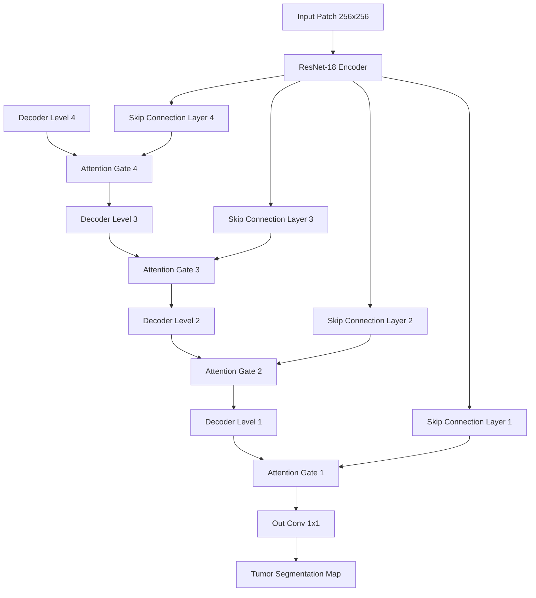

# Premium Histopathology Tumor Detection and Segmentation Pipeline

An end-to-end, high-performance deep learning pipeline designed to detect and segment tumor regions in gigapixel-scale whole slide images (WSIs). Built with **PyTorch**, this project supports transfer learning, dynamic spatial augmentations, custom attention blocks, and advanced diagnostic metrics (FROC, Dice, and IoU).

---

## 🚀 Key Features

*   **Dual Segmentation Architectures**: Implements both a baseline **ResNet-UNet** (using a ResNet-18 encoder) and an advanced **Attention-UNet** featuring soft Attention Gates in skip connections to ignore background artifacts and focus on tumor boundaries.
*   **Macenko Stain Normalization**: Corrects lab-specific staining variations by transforming RGB pixels to Optical Density (OD), extracting extreme stain directions via singular value decomposition (SVD), and mapping them to a standard reference patch. Supports GPU acceleration via `torchstain`.
*   **Otsu Tissue Segmentation**: Automatically segments foreground tissue from background slide glass by identifying the optimal threshold on the saturation channel.
*   **Synthetic WSI Slide Simulator**: Synthesizes custom gigapixel-like tissue slides (including simulated stroma, cell nuclei, and tumor clusters) for local pipeline validation and dry-runs on resource-constrained machines.
*   **Whole-Slide Heatmap Stitched Reconstruction**: Employs a sliding-window grid search to predict patch probability scores, stitching them back into a full WSI tumor probability heatmap with overlapping strides.
*   **Diagnostic Curve Plotting**: Automates Free-Response ROC (FROC) curve calculations and stain-normalization ablation studies.

---

## 📐 Architecture Overview

### 1. ResNet-UNet
Utilizes a pretrained ResNet-18 backbone as the feature extraction encoder. Features are downsampled through convolutional layers, then upsampled back using transposed convolutions coupled with concatenate skip connections to preserve high-frequency spatial boundaries.

### 2. Attention-UNet
Integrates **Attention Gates** in the decoder. Skip connections from the encoder are gating-weighted by coarser feature signals from the decoder using $1 \times 1$ convolutions and a Sigmoid activation function. This suppresses activations in non-tumor areas (such as glass, background tissue, and red blood cells), increasing boundary segmentation precision.



---

## 🛠️ Project Structure

```
histopathology_segmentation/
│
├── config.py              # Directory paths, VRAM options, and training hyperparameters
├── data_pipeline.py       # WSI reader, Otsu mask, Macenko normalizer, and PyTorch Datasets
├── models.py              # ResNet18 Classifier, Standard UNet, and Attention UNet definitions
├── train.py               # Custom training loops, validation phases, and Mixed Precision support
├── evaluate.py            # FROC calculation, ablation study, and WSI heatmap stitching
├── main.py                # Pipeline CLI (orchestrates simulation, extraction, training, and testing)
├── requirements.txt       # Project python dependencies
├── .gitignore             # Git ignored files (checkpoints, logs, workspace artifacts)
└── README.md              # Project documentation
```

---

## 📥 Installation

Ensure you have **Python 3.10+** and CUDA enabled environment (optional but recommended).

1. Clone the repository and navigate to the root directory:
   ```bash
   git clone <your-repository-url>
   cd histopathology_segmentation
   ```
2. Install the required Python packages:
   ```bash
   pip install -r requirements.txt
   ```
3. *(Optional)* Install OpenSlide tools for reading large `.svs` or `.tif` files:
   - On Mac: `brew install openslide`
   - On Ubuntu: `sudo apt-get install openslide-tools`

---

## 💻 Usage & CLI Guide

The pipeline is managed via the command-line interface in `main.py`.

### 1. Complete Execution (All Steps)
Generate mock slides, extract balanced training patches, train the Attention-UNet model, and perform whole-slide evaluations:
```bash
python main.py --mode all --model_type attention_unet --epochs 5
```

### 2. Generate Simulated Slides
To create synthetic slides and matching tumor masks:
```bash
python main.py --mode simulate --slides_count 5 --patch_size 128
```

### 3. Extract and Balance Patches
To read files from `raw_slides/` and extract training/validation patches matching target configurations:
```bash
python main.py --mode extract --patch_size 128
```

### 4. Train Model
Train a segmentation model using the extracted patches in `extracted_patches/`:
```bash
python main.py --mode train --model_type attention_unet --epochs 10
```

### 5. Evaluate and Visualize Outputs
Evaluate the trained checkpoint and save visualization plots (ablation study, FROC curves, slide heatmap) into the outputs directory:
```bash
python main.py --mode evaluate --model_type attention_unet
```

---

## 📊 Evaluation Metrics

*   **Dice Overlap Coefficient**: Measures pixel-wise segmentation overlap between predicted binary masks and ground truth labels.
    $$\text{Dice} = \frac{2 \times |Y \cap \hat{Y}|}{|Y| + |\hat{Y}|}$$
*   **Intersection over Union (IoU / Jaccard Index)**: Quantifies the intersection area divided by the union area.
*   **FROC Curve**: Plots sensitivity (tumor detection rate) against the average number of false positives per slide image to identify optimal detection thresholds.
*   **Stain Normalization Ablation Study**: Compares the model's Dice score under severe color-shifted inputs with and without Macenko stain normalization.
